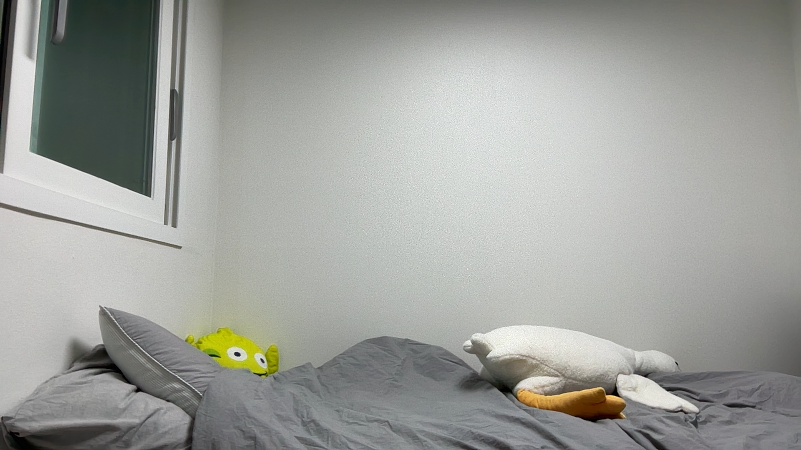
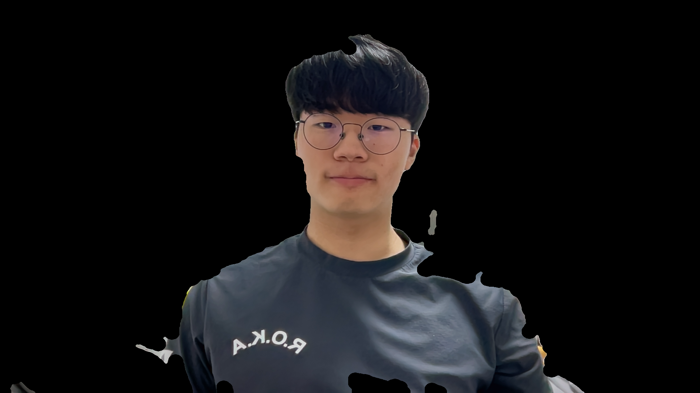
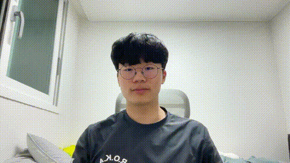
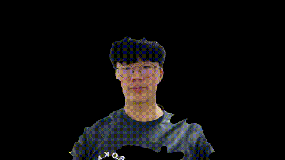

# Video Recorder with Background Subtraction

OpenCV를 사용해 웹캠 영상을 실시간으로 확인하고, 밝기/대비/민감도를 조절하며, 원본 및 배경제거 영상을 저장하는 프로젝트입니다.

## 📸 결과물 미리보기 (Screenshots & Demo)

### 1. 정지 영상 스냅샷 (Snapshots)

| 기준 배경 (`assets/background.png`) | 전경 추출 결과 (`assets/output_face.png`) |
|:---:|:---:|
|  |  |

### 2. 녹화 동영상 비교 (Video Comparison)

| 원본 녹화 (`assets/output.gif`) | 배경 제거 녹화 (`assets/output_no_background.gif`) |
|:---:|:---:|
|  |  |

> **Tip:** 프로그램을 실행하고 `Space` 키(녹화), `B` 키(배경 저장), `F` 키(객체 스냅샷)를 누르면 `assets/` 폴더에 파일이 생성됩니다.  
> GIF는 `ffmpeg -i assets/output.avi assets/output.gif` 명령어로 변환하여 확인할 수 있습니다.

## 주요 기능

- **실시간 카메라 미리보기:** 밝기/대비가 조절된 영상을 실시간으로 확인 (좌우 반전 적용)
- **밝기/대비 조절:** 실시간으로 영상의 명암비와 밝기 변경
- **실시간 민감도 제어:** 차영상(Background Subtraction)의 민감도를 조절하여 이마 번들거림이나 그림자 소실 방지
- **원본 영상 녹화:** `assets/output.avi` (밝기/대비 조절 반영)
- **배경 제거 영상 녹화:** `assets/output_no_background.avi`
- **전경 스냅샷 저장:** 현재 화면에서 추출된 객체를 `assets/output_face.png`로 저장

## 실행 환경

- Python 3.x
- OpenCV (`cv2`), NumPy

설치:

    pip install opencv-python numpy

실행:

    python __main__.py

## 키 조작

| 키 | 동작 |
|---|---|
| `←` / `→` | 대비(Contrast) 감소 / 증가 |
| `↑` / `↓` | 밝기(Brightness) 증가 / 감소 |
| `+` / `=` | 배경 제거 민감도 증가 (그림자/이마 구멍 메우기) |
| `-` | 배경 제거 민감도 감소 (노이즈 제거) |
| `Space` | 녹화 시작 / 중지 |
| `R` | 밝기·대비·민감도 초기화 |
| `B` 또는 `1` | 현재 프레임을 배경으로 저장 (`assets/background.png`) |
| `F` 또는 `2` | 배경 제거된 객체 이미지 저장 (`assets/output_face.png`) |
| `ESC` | 프로그램 종료 |

## 출력 파일 (assets/ 폴더)

- `output.avi`: 밝기/대비가 적용된 원본 녹화본
- `output_no_background.avi`: 배경이 제거된 전경 객체 녹화본
- `background.png`: 저장된 기준 배경 이미지
- `output_face.png`: 추출된 전경 객체 스냅샷

## 동작 원리 (고도화된 차영상 알고리즘)

`extract_foreground` 함수는 다음 절차로 고품질 전경을 추출합니다.

1. **가우시안 블러(Gaussian Blur)**를 통한 사전 노이즈 제거
2. **RGB + HSV(Saturation) 병합:** 단순히 밝기 차이만 보지 않고, 피부색의 채도 변화를 함께 감지하여 이마의 번들거림이나 배경과 유사한 옷 색상 문제를 보완합니다.
3. **이미지 그레이딩 (정규화):** 차영상 신호를 0~255 범위로 증폭하여 해상력을 극대화합니다.
4. **사용자 정의 민감도 이진화:** Otsu 알고리즘으로 기준점을 잡은 뒤, 사용자가 설정한 민감도에 따라 문턱값을 동적으로 낮추어 미세한 객체까지 포착합니다.
5. **정밀 모폴로지(Morphology) 연산:** 큰 커널(21x21)의 `CLOSE` 연산을 통해 얼굴-목-몸통 사이의 단절된 영역을 강제로 연결하고 내부 구멍을 메웁니다.
6. **동적 면적 필터링:** 전체 화면 면적 대비 일정 비율 이상의 덩어리들만 유효한 객체로 병합하여 출력합니다.

## 사용 팁

- 배경을 저장할 때(`B` 키)는 카메라 앞에서 잠시 비켜서서 빈 배경이 찍히도록 하세요.
- **이마나 목 부분이 뚫려 보인다면 `+` 키를 눌러 민감도를 높이세요.**
- 조명이 바뀌거나 카메라 위치가 이동하면 `B` 키를 눌러 배경을 갱신하는 것이 좋습니다.
